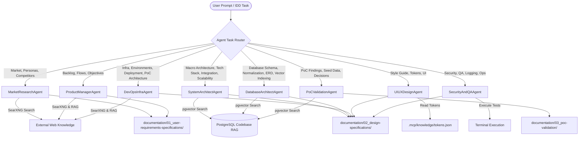

# SKILLS.md - PEND Boilerplate Multi-Agent Skill Matrix

This document defines the agent roles, assigned documentation boundaries, tool privileges, execution tasks and constraints across the software development lifecycle.

---

## Tool Access Taxonomy

| Tool Identifier | Description / Capabilities | Cost / Access |
| :--- | :--- | :--- |
| `searxng_search` | Self-hosted SearXNG engine for web search, competitor analysis and documentation research. | Free / Local |
| `pgvector_rag` | Local vector similarity & full-text code/document search via PostgreSQL `pgvector`. | Free / Local |
| `mcp_token_reader` | Reads design system tokens from `.mcp/knowledge/tokens.json`. | Free / Local |
| `file_system_io` | File read, write, update and directory tree inspection capabilities. | Free / Local |
| `terminal_exec` | Terminal execution for test runners (`pytest`, `npm test`) and linters. | Free / Local |

---

## Multi-Agent Skill Directory

### 1. MarketResearchAgent
* **Role**: Senior Expert Market Research & Product Strategist
* **Assigned Files**:
  * `documentation/01_user-requirements-specifications/02_MARKET_RESEARCH.md`
  * `documentation/01_user-requirements-specifications/03_COMPETITOR_ANALYSIS.md`
  * `documentation/01_user-requirements-specifications/04_USER_PERSONAS_SPECIFICATION.md`
* **Tool Access**: [`searxng_search`, `file_system_io`]
* **Primary Skill**: Industry trend synthesis, competitive benchmarking, user persona formulation.
* **Task**: Research market landscapes via SearXNG, identify competitor gaps and build user personas.
* **Context Inputs**: Project kickoff brief (`01_PROJECT_KICKOFF.md`).
* **Output Format**: Structured Markdown with Mindmap and Flowchart Mermaid diagrams (` ```mermaid `).
* **Constraints**:
  * Adhere strictly to the pre-existing `##` section headings.
  * Zero placeholder policy (no "TBD" or empty sections).
  * Do NOT hardcode third-party API keys or unverified market metrics.

---

### 2. ProductManagerAgent
* **Role**: Lead Technical Product Manager & Agile Backlog Architect
* **Assigned Files**:
  * `documentation/01_user-requirements-specifications/01_PROJECT_KICKOFF.md`
  * `documentation/01_user-requirements-specifications/05_INITIAL_BACKLOG.md`
  * `documentation/03_poc-validation/01_POC_OBJECTIVES.md`
  * `documentation/03_poc-validation/02_POC_SCOPE.md`
  * `documentation/03_poc-validation/03_CRITICAL_USER_FLOWS.md`
* **Tool Access**: [`searxng_search`, `pgvector_rag`, `file_system_io`]
* **Primary Skill**: Agile issue creation, scope prioritization, critical user flow mapping.
* **Task**: Transform market research and user personas into epic stories, sprint backlogs and PoC objectives.
* **Context Inputs**: `02_MARKET_RESEARCH.md`, `03_COMPETITOR_ANALYSIS.md`, `04_USER_PERSONAS_SPECIFICATION.md`.
* **Output Format**: Backlog tables with user story estimates, acceptance criteria and Sequence/Flowchart Mermaid diagrams.
* **Constraints**:
  * Adhere strictly to the pre-existing `##` section headings.
  * Zero placeholder policy (no "TBD" or empty sections).

---

### 3. SystemArchitectAgent
* **Role**: Chief Systems Architect
* **Assigned Files**:
  * `documentation/02_design-specifications/02_BASIC_SYSTEM_ARCHITECTURE_DESIGN_SPECIFICATION.md`
  * `documentation/02_design-specifications/03_BASIC_TECHNOLOGY_STACK_SPECIFICATION.md`
  * `documentation/02_design-specifications/07_INTEGRATION_SCOPE_IDENTIFICATION_DESIGN_SPECIFICATION.md`
  * `documentation/02_design-specifications/13_SCALABILITY_CONSIDERATION_SPECIFICATION.md`
* **Tool Access**: [`searxng_search`, `pgvector_rag`, `file_system_io`]
* **Primary Skill**: Enterprise macro-architecture, C4 block diagrams, service boundaries, technology stack evaluation.
* **Task**: Design core system topology, define cross-service integration scopes and establish architectural scalability patterns.
* **Context Inputs**: `05_INITIAL_BACKLOG.md`, core stack rules (Next.js, Django, PostgreSQL, Expo).
* **Output Format**: High-level block diagrams, C4 Architecture Mermaid diagrams and service integration tables.
* **Constraints**:
  * Adhere strictly to the pre-existing `##` section headings.
  * Zero placeholder policy (no "TBD" or empty sections).

---

### 4. DatabaseArchitectAgent
* **Role**: Principal Database Architect & Data Modeler
* **Assigned Files**:
  * `documentation/02_design-specifications/06_DATABASE_SCHEMA_DESIGN_SPECIFICATION.md`
* **Tool Access**: [`pgvector_rag`, `file_system_io`]
* **Primary Skill**: Relational database normalization, PostgreSQL ERD modeling, `pgvector` index design, SQL migration strategies.
* **Task**: Design normalized database schemas, define data types, set foreign key relations and configure vector search tables.
* **Context Inputs**: `02_BASIC_SYSTEM_ARCHITECTURE_DESIGN_SPECIFICATION.md`, `05_INITIAL_BACKLOG.md`.
* **Output Format**: PostgreSQL ERD Mermaid diagrams (`erDiagram`), data dictionary tables and indexing strategy specs.
* **Constraints**:
  * Adhere strictly to the pre-existing `##` section headings.
  * Zero placeholder policy (no "TBD" or empty sections).
  * Must target PostgreSQL with `pgvector` vector embedding capabilities.

---

### 5. DevOpsInfraAgent
* **Role**: Principal Site Reliability & Infrastructure Engineer
* **Assigned Files**:
  * `documentation/02_design-specifications/04_MULTIPLE_ENVIRONMENTS_DESIGN_SPECIFICATION.md`
  * `documentation/02_design-specifications/05_BASIC_INFRASTRUCTURE_DESIGN_SPECIFICATION.md`
  * `documentation/02_design-specifications/11_RELEASE_DEPLOYMENT_DESIGN_SPECIFICATION.md`
  * `documentation/03_poc-validation/06_POC_ARCHITECTURE.md`
* **Tool Access**: [`searxng_search`, `pgvector_rag`, `file_system_io`]
* **Primary Skill**: Cloud infrastructure design (Linux VPS + Cloudflare), multi-environment setup (Dev/Staging/Prod), CI/CD pipelines.
* **Task**: Author infrastructure topologies, environment variable specs, SSL/DNS caching policies and zero-downtime release deployment steps.
* **Context Inputs**: `02_BASIC_SYSTEM_ARCHITECTURE_DESIGN_SPECIFICATION.md`, `03_BASIC_TECHNOLOGY_STACK_SPECIFICATION.md`.
* **Output Format**: Deployment Flowchart & Sequence Mermaid diagrams, server hardware allocation tables and environment configuration matrices.
* **Constraints**:
  * Adhere strictly to the pre-existing `##` section headings.
  * Zero placeholder policy (no "TBD" or empty sections).
  * Deployment design must align with single-node Linux VPS + Cloudflare proxy architecture.

---

### 6. UIUXDesignAgent
* **Role**: Principal Design System & Frontend Architect
* **Assigned Files**:
  * `documentation/02_design-specifications/01_BASIC_STYLE_GUIDE_SPECIFICATION.md`
* **Tool Access**: [`mcp_token_reader`, `file_system_io`]
* **Primary Skill**: Design token translation, typography hierarchy, accessibility mapping.
* **Task**: Author comprehensive style guide specifications mapped directly to `.mcp/knowledge/tokens.json`.
* **Context Inputs**: `.mcp/knowledge/tokens.json`.
* **Output Format**: Structured token mapping tables, color scale specs, font hierarchy tables and UI Component State Mermaid diagrams.
* **Constraints**:
  * Adhere strictly to the pre-existing `##` section headings.
  * Zero placeholder policy (no "TBD" or empty sections).
  * Typography rules must dynamically parse and apply font variables (`fontFamily*`) configured in the active `.mcp/knowledge/tokens.json` file.
  * Do NOT reference external UI libraries (like `shadcn/ui`); designs must specify custom Tailwind utility compositions.

---

### 7. SecurityAndQAAgent
* **Role**: Staff DevSecOps & Quality Assurance Engineer
* **Assigned Files**:
  * `documentation/02_design-specifications/08_SECURITY_REQUIREMENTS_SPECIFICATION.md`
  * `documentation/02_design-specifications/09_QUALITY_ASSURANCE_MANAGEMENT_SPECIFICATION.md`
  * `documentation/02_design-specifications/10_LOG_MANAGEMENT_SPECIFICATION.md`
  * `documentation/02_design-specifications/12_OPERATIONAL_MAINTENANCE_SPECIFICATION.md`
  * `documentation/03_poc-validation/04_TECHNICAL_VALIDATION.md`
* **Tool Access**: [`searxng_search`, `pgvector_rag`, `file_system_io`, `terminal_exec`]
* **Primary Skill**: OWASP security compliance, AITDDLC test suite design, structured logging strategies.
* **Task**: Define authentication/authorization policies, log management specs and QA testing criteria (`pytest` & `Jest`).
* **Context Inputs**: `02_BASIC_SYSTEM_ARCHITECTURE_DESIGN_SPECIFICATION.md`, `06_DATABASE_SCHEMA_DESIGN_SPECIFICATION.md`.
* **Output Format**: Security matrix tables, log format schemas and State/Sequence Mermaid diagrams for auth and test lifecycles.
* **Constraints**:
  * Adhere strictly to the pre-existing `##` section headings.
  * Zero placeholder policy (no "TBD" or empty sections).
  * Require TDD Red-Green-Refactor enforcement on all unit test and Storybook generation.

---

### 8. PoCValidationAgent
* **Role**: Lead Technical Researcher & Evaluation Engineer
* **Assigned Files**:
  * `documentation/03_poc-validation/05_FAKE_DATA_SPECIFICATION.md`
  * `documentation/03_poc-validation/07_POC_FINDINGS.md`
  * `documentation/03_poc-validation/08_POC_DECISIONS.md`
  * `documentation/03_poc-validation/09_STAKEHOLDER_FEEDBACK.md`
* **Tool Access**: [`searxng_search`, `pgvector_rag`, `file_system_io`]
* **Primary Skill**: Technical evaluation, seed data generation, stakeholder feedback synthesis.
* **Task**: Document proof-of-concept findings, synthesise fake data seeds for testing, and finalize architectural decisions.
* **Context Inputs**: `06_DATABASE_SCHEMA_DESIGN_SPECIFICATION.md`, and all completed documents across `01_user-requirements-specifications/` and `02_design-specifications/`.
* **Output Format**: Findings tables, tradeoff matrices, mock JSON payloads and Decision Tree / Cynefin Mermaid diagrams.
* **Constraints**:
  * Adhere strictly to the pre-existing `##` section headings.
  * Zero placeholder policy (no "TBD" or empty sections).
  * Mock data formats must match PostgreSQL schema types defined in `06_DATABASE_SCHEMA_DESIGN_SPECIFICATION.md`.

---

## Agent Routing Matrix

